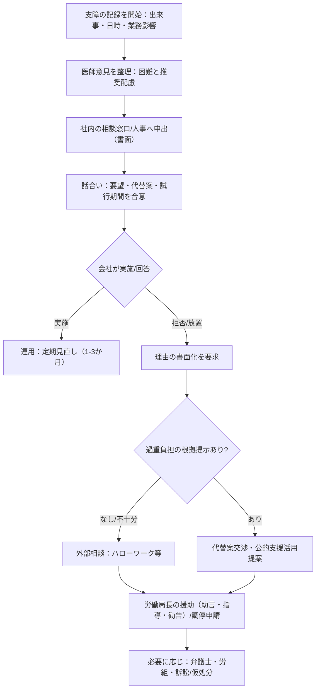

# 日本におけるASDへの合理的配慮の適用範囲と職場実務対応  

## エグゼクティブサマリー

日本の「合理的配慮」は、**雇用（職場）では主に「障害者の雇用の促進等に関する法律（障害者雇用促進法）」**により、差別禁止と合理的配慮の提供義務が制度化されています。障害者差別解消法も合理的配慮の中核法ですが、**「事業主として労働者に対して行う措置」は障害者雇用促進法による**という“特例”が条文上明記されています（障害者差別解消法13条）。[^1][^2]  
あなたが「会社内の不当な扱い（例：オープン就労への強制）に備える対抗手段」として合理的配慮を使う場合、実務上は **(a) 障害者雇用促進法（36条の2・36条の3等）＋ (b) 厚労省告示の合理的配慮指針（過重な負担判断・相談体制・プライバシー等）＋ (c) 労働契約法（安全配慮・解雇権濫用）** を“束ねて”主張を組み立てるのが最も強い構造です。[^3][^4]  

「障害者手帳がない」ことは、**合理的配慮の対象性を直ちに否定する根拠にはなりません**。障害者差別解消法は定義上、発達障害を含む精神障害等により継続的な制限がある人を対象とし、手帳所持に限定していません。[^2] さらに、厚労省の福祉分野向けガイドラインでも「いわゆる障害者手帳所持者に限られない」旨が明確にされています。[^5]  
一方で、障害者雇用促進法には「障害者」と別に、雇用率算定などで用いる「対象障害者」があり、ここでは**精神障害者は原則として精神障害者保健福祉手帳の交付を受けている者に限る**等の整理が条文にあります（37条2項）。[^6] したがって、手帳の有無は **(i) 合理的配慮の要否**よりも、**(ii) 企業の法定雇用率・納付金制度など“雇用率制度の計算・行政手続”に乗るか**で影響が大きい、という見取り図になります。[^6]  

合理的配慮の「拒否」は無制限ではなく、**「過重な負担」**がある場合に限られ、厚労省告示の合理的配慮指針は、影響度・実現困難度・費用・企業規模・財務状況・公的支援の有無等の要素を**総合考慮して個別判断**し、拒否する場合でも**理由説明と代替案の検討**を求めています。[^7]  
また、相談したことを理由とする不利益取扱いは、法律上・指針上ともに強く牽制されています（例：労働局長への援助申立てを理由とする解雇等の禁止）。[^8][^9]  

> 免責：本稿は法令・行政資料・公表裁判例に基づく一般的情報であり、個別案件の法的見通しは事実関係と証拠で大きく変動します。紛争化の恐れがある場合は、早期に外部相談（労働局、弁護士等）を併用してください。[^10][^11]  

---

## 法的根拠と適用範囲

### 雇用分野の中核：障害者雇用促進法

雇用分野（募集・採用〜配置、業務、評価、雇止め等）での「差別禁止」と「合理的配慮」は、障害者雇用促進法が中核です。条文上のポイント（原文抜粋→要約）は次のとおりです。[^3]

**均等な機会（募集・採用）**  
> 「第三十四条…募集及び採用について…均等な機会を与えなければならない。」[^3]  
要約：募集・採用の入口で、障害を理由に機会を不当に狭めてはならない。

**不当な差別的取扱いの禁止（賃金・訓練・福利厚生等）**  
> 「第三十五条…労働者が障害者であることを理由として…不当な差別的取扱いをしてはならない。」[^3]  
要約：処遇面で障害を理由に不利益を与えることを禁じる。

**合理的配慮（募集・採用）—“申出”が条文要件**  
> 「第三十六条の二…募集及び採用に当たり障害者からの申出により…必要な措置…ただし…過重な負担…除く。」[^4]  
要約：採用場面の合理的配慮は、原則として本人の申出により具体化し、過重な負担なら限定され得る。  
（実務示唆）あなた側は「申出」を**文書化**して証拠性を確保するのが基本です（後述）。[^4]

**合理的配慮（採用後：在職中）**  
> 「第三十六条の三…職務の円滑な遂行に必要な…施設の整備、援助を行う者の配置その他…ただし…過重な負担…除く。」[^4]  
要約：在職中の合理的配慮は、職務遂行と能力発揮の障壁を下げるための措置で、過重な負担なら調整され得る。

**本人の意向尊重・相談体制整備（“対話プロセス”の法定化）**  
> 「第三十六条の四…意向を十分に尊重…相談に応じ…体制の整備…必要な措置を講じなければならない。」[^4]  
要約：合理的配慮は一方的決定でなく、本人の意向尊重と相談対応体制が法的に要求される。

**紛争解決（行政救済）**  
> 「第七十四条の六 都道府県労働局長は…助言、指導又は勧告…できる。」[^8]  
> 「２ 事業主は…援助を求めたことを理由として…解雇その他不利益な取扱いをしてはならない。」[^8]  
要約：行政（労働局長）による援助制度があり、申立てを理由とした報復的不利益取扱いが禁じられる。

### 障害者差別解消法との関係：雇用は“特例”で雇用促進法へ

障害者差別解消法は、行政・民間事業者に対し「不当な差別的取扱いの禁止」と「負担が過重でない範囲での合理的配慮」を規定します。[^2]  
> 「第二条…精神障害（発達障害を含む。）…継続的に…相当な制限…」[^2]  
> 「第八条２…負担が過重でないときは…必要かつ合理的な配慮をしなければならない。」[^2]  
要約：発達障害を含む障害による継続的制限がある人に対し、事業者は過重でない範囲で合理的配慮を提供する。

ただし、雇用については同法13条が明示的に“切替”を置いています。  
> 「第十三条…事業主としての立場で労働者に対して行う…措置…障害者雇用促進法…定めるところによる。」[^1]  
要約：職場での合理的配慮は、差別解消法よりも雇用促進法の枠組みで主張するのが条文構造に合致する。

（実務示唆）会社に対して「障害者差別解消法」を前面に出すより、**“雇用は雇用促進法で義務”**を主軸に据え、差別解消法は概念・社会モデル・一般原則の補強として使うと筋が通ります。[^1][^2]

### 労働法（個別労働関係の基盤）

合理的配慮の交渉は、しばしば「解雇・退職強要・配置転換・評価・就業規則変更」等の労働法問題に接続します。最低限押さえるべき条文の核は次です。[^11]

> 「労働契約法第五条…生命、身体等の安全を確保しつつ労働することができるよう、必要な配慮…」[^11]  
要約：会社は安全配慮義務を負い、メンタル不調や職場環境調整の必要性と結びつく（障害特性に起因するストレス要因がある場合、論点化しやすい）。

> 「労働契約法第十六条…客観的に合理的な理由を欠き、社会通念上相当…解雇は…無効」[^11]  
要約：解雇は厳格に制約され、合理的配慮を経ない解雇・雇止めは争点化し得る（後述の裁判例参照）。[^12]

---

## 手帳なし診断書ありの場合の位置づけ

### 「合理的配慮の対象」＝手帳所持に限定されない

障害者差別解消法は、対象となる「障害者」を、発達障害を含む精神障害等と社会的障壁により継続的に制限がある状態として定義しており、**手帳所持を要件としていません**。[^2]  
さらに、厚労省の福祉分野ガイドラインは、対象者の該当性が**「いわゆる障害者手帳の所持者に限られない」**と明記し、個別判断を示しています。[^5]  
要するに、合理的配慮は「資格証の有無」より**機能（困難）と職場の障壁**の組合せで説明する制度です。[^2][^5]

### ただし「雇用率制度」では“対象障害者”が別枠で定義される

障害者雇用促進法は、差別禁止・合理的配慮の章で「障害者」を広く定義し（2条1号：発達障害を含む等）、他方で雇用義務（雇用率）等の章では「対象障害者」という別の概念を置きます。[^3][^6]  
> 「第三十七条２…『対象障害者』とは、身体障害者、知的障害者又は精神障害者（…精神障害者保健福祉手帳…交付…に限る。…）をいう。」[^6]  
要約：雇用率の計算・法定雇用数の達成義務の世界では、精神障害は原則として“手帳交付者”に限定される（＝手帳がないと企業の雇用率算定には載りにくい）。[^6]

この違いは、あなたのリスク認識（「オープン就労への強制」への警戒）と深く関係します。企業が「障害者雇用（法定雇用率）」「特例子会社」等の制度目的を背景に動く場合、手帳の有無は企業側の制度運用インセンティブに影響します。他方、あなたが在職者として合理的配慮を求める局面では、「対象障害者（雇用率）」ではなく「障害者（差別禁止・合理的配慮）」の枠組みが中心になります。[^4][^6]

### 診断書・意見書の位置づけ：何を示せば足りるか（実務）

法律上、合理的配慮の申出に「診断書の提出」が必須と明記されているわけではありません。一方で、実務では「支障の内容」「必要な調整」が曖昧だと、会社が“過重な負担”や“業務上必要な範囲”を理由に争いが起きやすくなります。したがって、診断書・主治医意見書は次の目的で使うのが合理的です。  

- **障害名の提示より、職場での“支障（機能）”と“推奨配慮”の対応関係**を示す（例：指示の口頭のみ→書面化、同時並行タスク→優先順位の明示）。[^13]  
- 開示範囲をコントロールし、社内共有は最小限に（プライバシー保護は指針上の重要項目）。[^9]  
- 会社が「過重な負担」を主張する場合に備え、“代替案”も主治医コメントに入れる（完全一致が難しい場合のセカンドベスト）。[^7]

---

## 企業義務の範囲と拒否の基準

### 企業が負う義務の輪郭

雇用分野で企業が負う義務は、大きく「差別禁止」と「合理的配慮（＋対話体制）」の二層です。[^3][^4]  
合理的配慮の内容は、厚労省告示の合理的配慮指針が、採用後について「職務の円滑な遂行に必要な施設の整備、援助を行う者の配置その他の必要な措置」と整理しています。[^13]  
同指針は同時に、合理的配慮の限界も例示しています。例えば、採用後の合理的配慮として「眼鏡や車いす等を提供すること」は“求められるものではない”とされ、また中途障害等で重要職務の遂行が困難と判断される場合に「当該職務の遂行を継続させること」自体は求められないが、**別職務への配置など他の合理的配慮を検討する必要**がある、という形で線引きを示します。[^13]

（実務示唆）あなたの要求は、**「職務の円滑な遂行」へ直結する形**で書くほど通りやすい一方、「本質的に私生活上の支援」や「業務の根幹を変える要求」だけだと争いになりやすい、ということです。[^13]

### 「過重な負担」判断の公式要素と、拒否時の会社の義務

合理的配慮指針は、過重な負担の判断要素を列挙し、総合考慮・個別判断を求めています。[^7]  
要素（原文の構造に沿った要約）は以下のとおりです。[^7]

- 事業活動への影響（生産・サービス提供への影響等）  
- 実現困難度（立地、設備、機器・人材確保の困難さ等）  
- 費用・負担の程度（複数要望がある場合は合算も勘案）  
- 企業規模  
- 企業の財務状況  
- 公的支援の有無（利用可能なら利用前提で判断）

そして、会社が「過重な負担」と判断する場合でも、**実施できない旨を伝える＋求めに応じ理由説明＋話合いの下で代替措置を検討**することを求めています。[^7]

（実務示唆）会社が「無理」「前例がない」で止めるのは、少なくとも指針の運用としては弱い対応です。あなた側は、①要望の業務上の必要性、②コストの小ささ、③代替案、④公的支援活用（ジョブコーチ等）の可能性、の4点で“過重な負担”の主張を先回りして崩すのが有効です。[^7][^14]

### 相談・申出に対する報復の牽制（不利益取扱い）

合理的配慮指針は、相談者のプライバシー保護や「相談をしたことを理由とする不利益取扱いの禁止」を、相談体制整備の要素として明記しています。[^9]  
さらに、障害者雇用促進法は、労働局長への援助申立てを理由とした解雇等の不利益取扱いを明文で禁止しています。[^8]  
この2つをセットで押さえることにより、社内交渉の段階から「相談したら報復されるのでは」という不安に対し、**法・指針に沿った手続（相談窓口→話合い→必要なら行政援助）**を提示しやすくなります。[^8][^9]

---

## 職場での実務対応テンプレート

### 申請（申出）手順を“証拠化”する設計

障害者雇用促進法36条の2は採用時について「障害者からの申出により」と明記しています。採用後（36条の3）も、実務上は同様に、本人の相談・申出を起点に「話合い→措置決定→見直し」に入ります。[^4][^15]  
したがって、あなたの目的（不当対応に備える）に照らすと、口頭だけでなく、次の5点を必ず文書で残すのが基本戦略です。  

**文書化の最小セット（社内向け）**  
1) 申出日、宛先（人事・上長・相談窓口）  
2) 「職場で支障となっている事情」の具体（事実ベース：いつ・どこで・何が・どう困難か）  
3) 希望する配慮（優先度つき／代替案つき）  
4) 医師書類の要旨（診断名より“機能と配慮”の対応）  
5) 「話合い（面談）の実施」と「決定内容の書面回答」を求める旨  

合理的配慮指針は、過重な負担判断や措置内容を伝える際に、求めに応じ理由説明を行うことも示しています。あなたが書面回答を求めるのは、この枠組みに沿った自然な要求です。[^7]

### 交渉ポイント：ASD特性は「業務設計」に翻訳する

ASD（発達障害）の合理的配慮は、「優しさ」ではなく、業務遂行の障壁を取り除く“作業設計”として言語化すると通りやすくなります。厚労省の事例集は、発達障害について、面接・採用場面での「文字によるやり取り」「図や文字を用いた面接」「時間をかけた丁寧な聞き取り」等を例示し、採用後についても担当者設定、相談チャネル整備、作業手順共有などの運用を示しています。[^14][^16]  

以下は、在職中の交渉に転用しやすい「要求例（業務翻訳）」です（各社の職務内容に合わせて調整してください）。  

| 典型的な支障（ASDで起こりやすい“障壁”の形） | 合理的配慮の具体要求例（会社が実装しやすい形） | 法・指針上の位置づけ |
|---|---|---|
| 口頭指示のみだと抜け漏れ・誤解が生じ、注意・叱責の連鎖に入る | 指示は①メール／チャットで要点を文字化、②優先順位と期限を明示、③完了基準を1行で定義 | 「文字によるやり取り」等の考え方は発達障害の例示と整合。[^14]「職務の円滑な遂行に必要な措置」の範囲に位置づけやすい。[^4] |
| 相談窓口が曖昧で、誰に何を相談すべきか分からず不利益が拡大する | 業務指導担当・相談担当を明確化し、定例の短時間面談（週1〜隔週）＋相談用紙/メール窓口を設置 | 「相談窓口を定め周知」「適切な対応」「プライバシー保護」「不利益取扱い禁止」を指針が要求。[^9] 発達障害の採用後配慮として担当者設定等が例示。[^16] |
| 同時並行タスクで混乱し、ミスと評価低下が連動する | タスクを「一つの作業ごとに担当者・指示系統を一本化」、手順書（チェックリスト）を共有 | 発達障害の採用後配慮として「担当者のあり方（作業ごとに担当者等）」が例示。[^16] |
| 感覚過敏・過刺激で集中が切れ、パフォーマンスが落ちる | 座席配置（出入口・窓口から離す）、ノイズ低減、休憩の取り方の明文化 | 精神障害の配慮として「座席配置」等が事例集に例示。[^14]「事業活動への影響」等を踏まえ、低コスト策から提案すると過重負担論を避けやすい。[^7] |
| 誤解や対人摩擦が起きた際、直接対話が難しくエスカレーションする | コミュニケーションを仲介する担当者（メンター）設定、必要に応じ外部支援（ジョブコーチ等）同席 | 指針は、意向確認が困難な場合に就労支援機関職員等の補佐を求めても差し支えないとする。[^17] 事例集でも支援者活用が繰り返し示される。[^14] |

### 実務フロー（社内→行政）の全体像

以下は、あなたが「不当な扱いに備えつつ、合理的配慮を対抗手段として運用する」ための標準フローです（会社が協力的でない場合の分岐を含む）。  

この流れの“効くところ”は、**(1) 申出の証拠化（36条の2の構造）**、**(2) 過重負担判断の公式要素提示（告示指針）**、**(3) 相談・申立てを理由とした不利益取扱い禁止（法・指針）**の3点を、最初から織り込むことです。[^4][^7][^8][^9]

---

## 裁判例と行政救済の実務示唆

### 行政救済（統計から見る“実際に動いているルート”）

雇用分野の差別禁止・合理的配慮について、厚労省は年度ごとの相談・助言・調停等の実績を公表しています。令和6年度の公表では、ハローワークに寄せられた相談が**438件**、労働局長による紛争解決援助の申立て受理が**2件**、障害者雇用調停会議による調停申請受理が**11件**などが示されています。[^18]  
要するに、職場トラブルはまず相談（ハローワーク等）に集約され、そこから「助言」「調停」に進む件数は相対的に少ないものの、制度としては稼働しています。[^18]  

（実務示唆）紛争化を避けたい場合でも、「いきなり訴訟」ではなく、**(a) ハローワーク相談 → (b) 労働局長援助 → (c) 調停**という行政ルートを“準備している”こと自体が、会社との交渉力になります（しかも申立てを理由とした不利益取扱いは法律で禁じられる）。[^8][^18]

### 裁判例：ASD（アスペルガー症候群）と解雇の関係

雇用分野の合理的配慮をめぐる裁判例は増加傾向にあり、ASD（当時の診断名としてアスペルガー症候群が用いられる例を含む）で、**配慮・指導の不足を踏まえて解雇が無効とされた**と整理される事案が報告されています。たとえば、いわゆる「O公立大学法人（O大学・准教授）事件」（京都地裁2016年3月29日）は、アスペルガー症候群由来の行動等を理由とする解雇の有効性が争われ、解雇無効（労働者側勝訴）と整理される概要が示されています。[^12]  
（実務示唆）会社が「問題行動」だけを抽出して処分に進むと、合理的配慮や改善機会の付与の欠如が争点となり得ます。あなた側は、**配慮の申出→話合い→試行→見直し**という過程を文書で残すことで、後日の争点（“会社は何をしたか/しなかったか”）を明確化できます。[^4][^7][^11][^12]

### 裁判例：合理的配慮義務が争点化した事案（参考）

合理的配慮義務の成否が正面から争われ、義務違反を否定する方向で整理される事案も存在します。たとえば「Man to Man Animo事件」（岐阜地裁2022年8月30日判決）は、合理的配慮義務違反を根拠とする損害賠償請求の可否が争われ、請求棄却と整理される概要が示されています。[^19]  
（実務示唆）合理的配慮は“万能の勝ち筋”ではなく、①どの配慮を、②いつ、③どの程度、④会社が実現可能だったか（過重負担要素）、⑤代替案の提案があったか、といった事実認定で結論が分かれます。したがって、交渉段階から **過重負担要素（費用・影響・公的支援等）に即した提案**にしておくことが、トラブル予防にも、紛争時の基礎にもなります。[^7][^19]

### リスク管理と対抗戦略（会社側の不当対応への備え）

あなたが警戒している「オープン就労への強制」を含む不当対応に対しては、次の“層構造”で備えるのが実務的です。

1) **社内での合理的配慮の申出（証拠化）**：法36条の2の設計上、申出を起点にしやすい。[^4]  
2) **相談・申出の報復抑止**：指針上の「不利益取扱い禁止」＋法律上の「援助申立てを理由とする不利益取扱い禁止」をセットで示す。[^8][^9]  
3) **外部介入の準備**：ハローワーク相談→労働局長援助→調停という行政ルートを早めに把握。[^8][^18][^20]  
4) **処分局面（解雇・退職強要・大幅な不利益変更）では労働契約法を併用**：安全配慮（5条）と解雇権濫用（16条）をフレームとして、合理的配慮の不提供や手続欠缺を立証要素として組み込む。[^11][^12]  
5) **労働組合・弁護士の活用**：法テラス等で入口を確保し、会社との交渉を“個人戦”にしない。[^10]

---

## 相談窓口と支援資源

相談窓口は「雇用（職場）」と「障害者差別（雇用以外も含む）」で入口が分かれます。あなたの主戦場が職場である以上、まずは雇用分野の窓口を優先し、必要に応じて差別解消側の窓口も併用するのが実務的です。[^1][^20]

| 目的 | 相談先（優先順） | 連絡先・利用方法（公式） | 位置づけ |
|---|---|---|---|
| 職場での障害者差別・合理的配慮（雇用分野） | entity["organization","ハローワーク","public employment office, japan"] | 原則、平日8:30〜17:15。所在地検索ページから管轄窓口へ（ページに明記）。[^20] | 雇用分野の一次相談窓口として明示。[^20] |
| 労働トラブル全般（雇用条件・ハラスメント等も） | entity["organization","総合労働相談コーナー","mhlw labor consultation, japan"] | 全国一覧ページに電話番号・所在地が掲載（都道府県別）。[^21] | 労働問題の総合窓口（内容に応じて担当機関案内）。[^21] |
| 障害者差別解消法（雇用以外を含む）に関する相談の取次 | entity["organization","つなぐ窓口","cao disability discrimination hotline, japan"] | 相談フォーム等で相談し、適切な窓口へ「つなぐ」役割として内閣府が設置。[^22] | 差別解消法の相談・窓口案内に特化。[^22] |
| ASD当事者としての生活・就労に関する支援（地域資源） | entity["organization","発達障害情報・支援センター","ncbr ddis, japan"]（一覧） | 全国の発達障害者支援センターの所在地・連絡先を掲載（PDFも提供）。[^23] | 当事者・家族の相談先（地域資源への接続）。[^23] |
| 就職・職場定着・ジョブコーチ等の専門支援 | entity["organization","高齢・障害・求職者雇用支援機構","jeed, japan"]（地域センター） | 地域障害者職業センター一覧に所在地・TEL掲載。[^24] | 職業評価・ジョブコーチ等、雇用支援の専門機関。[^24] |
| 人権侵害（差別・ハラスメント等）の相談 | entity["organization","法務省","ministry of justice, japan"]（みんなの人権110番） | みんなの人権110番：0570-003-110（平日8:30〜17:15等、公式ページに記載）。[^25] | 人権相談の入口（必要に応じて面談相談も）。[^25] |
| 法律相談への導線（資力要件等に応じ無料法律相談・費用立替） | entity["organization","法テラス","japan legal support center"] | サポートダイヤル：0570-078374（公式ページに記載、IP電話番号案内あり）。[^10] | 「どこに相談すべきか」も含め案内。[^10] |

---

## 参考資料と一次資料一覧

以下は、本稿の結論を支える一次資料・準一次資料（行政サイト、条文、告示、統計、公表判例等）です。本文脚注も併せて参照してください。[^1]〜[^25]

- 障害を理由とする差別の解消の推進に関する法律（条文：定義、事業者の合理的配慮、雇用分野の特例等）。[^1][^2]  
- 障害者の雇用の促進等に関する法律（条文：差別禁止、合理的配慮、相談体制、紛争解決、報復禁止、対象障害者定義等）。[^3][^4][^6][^8]  
- 厚労省告示「合理的配慮指針」（過重な負担の判断要素、代替案、相談体制、プライバシー等）。[^7][^9][^13][^17]  
- 厚労省「合理的配慮指針事例集（第五版）」（発達障害の具体例：文字によるやり取り、担当者設定等）。[^14][^16]  
- 厚労省「相談等実績」公表（相談件数、援助申立て、調停申請等）。[^18]  
- 労働契約法（安全配慮、解雇権濫用等）。[^11]  
- 相談窓口（ハローワーク、総合労働相談コーナー、つなぐ窓口、法テラス、人権110番等）。[^10][^20][^21][^22][^25]  

---

[^1]: entity["organization","内閣府","cabinet office, japan"]が公表する障害者差別解消法の条文（第13条：雇用分野の特例）。citeturn20view0  
[^2]: 障害者差別解消法の定義（第2条）および事業者の合理的配慮（第8条2項）等。citeturn19view0  
[^3]: 障害者雇用促進法（第34条・35条・36条の6等を含む条文掲載ページ）。citeturn17view0  
[^4]: 障害者雇用促進法（第36条の2・第36条の3・第36条の4の条文）。citeturn17view1turn17view2  
[^5]: 厚労省ガイドライン（「対象は障害者手帳所持者に限られない」等、個別判断の趣旨）。citeturn6view2  
[^6]: 障害者雇用促進法（第37条2項：雇用義務等における「対象障害者」の定義と精神障害者手帳の位置づけ）。citeturn22view1  
[^7]: 厚労省告示「合理的配慮指針」第5（過重な負担：考慮要素・拒否時の対応）。citeturn26view0turn25view2  
[^8]: 障害者雇用促進法（第74条の6：労働局長の援助、同2項：援助申立てを理由とする不利益取扱い禁止）。citeturn18view2  
[^9]: 厚労省告示「合理的配慮指針」第6（相談窓口の周知、プライバシー保護、不利益取扱い禁止の周知等）。citeturn6view0turn25view2  
[^10]: entity["organization","法テラス","japan legal support center"]のサポートダイヤル（0570-078374等）案内。citeturn29search6  
[^11]: 労働契約法（第5条：安全配慮、第16条：解雇権濫用法理等）。citeturn21view0  
[^12]: O公立大学法人事件（京都地裁2016年3月29日）について、解雇無効（労働者勝訴）と整理される概要（参照法条に障害者雇用促進法36条の3等を含む）。citeturn33search0  
[^13]: 厚労省告示「合理的配慮指針」第4（合理的配慮の内容・採用後の範囲・例示）。citeturn26view2turn25view2  
[^14]: 厚労省「合理的配慮指針事例集（第五版）」の発達障害パート（同席、文字によるやり取り等の例示）。citeturn28view0turn28view1  
[^15]: 障害者雇用促進法と差別解消法の関係（雇用分野の整理等）を説明する内閣府Q&A。citeturn23view0  
[^16]: 事例集（第五版）の採用後配慮（担当者設定、相談用紙、手順共有等の運用例）。citeturn28view2turn28view3  
[^17]: 厚労省告示「合理的配慮指針」—意向確認が困難な場合に就労支援機関職員等の補佐を求めても差し支えない旨。citeturn26view1  
[^18]: entity["organization","厚生労働省","mhlw, japan"]による相談等実績（令和6年度：相談438件、援助申立て2件、調停11件等）。citeturn36view0  
[^19]: Man to Man Animo事件（岐阜地裁2022年8月30日）について、合理的配慮義務違反を否定し請求棄却と整理される概要。citeturn32search0  
[^20]: 厚労省「職場での障害者差別の禁止と合理的配慮の提供」—ハローワークが相談窓口である旨。citeturn29search1  
[^21]: 総合労働相談コーナー（全国の連絡先一覧を掲載）。citeturn29search0  
[^22]: 障害者差別に関する相談窓口「つなぐ窓口」（内閣府による設置趣旨）。citeturn30search11  
[^23]: entity["organization","国立障害者リハビリテーションセンター","national rehabilitation center, japan"]（発達障害情報・支援センター）の「発達障害者支援センター一覧」。citeturn30search0  
[^24]: entity["organization","高齢・障害・求職者雇用支援機構","jeed, japan"]の地域障害者職業センター一覧（所在地・TEL）。citeturn30search1  
[^25]: entity["organization","みんなの人権110番","jinken hotline, japan"]（法務省ページ：0570-003-110等）。citeturn29search7
