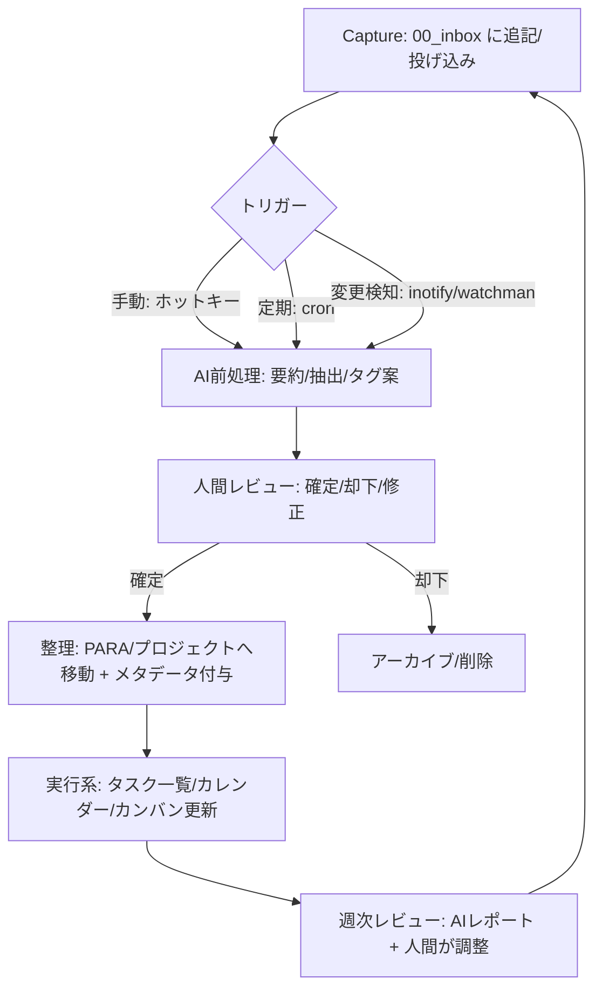

# GTD後継としてのAI前提プレーンテキスト生産性メソッド調査報告

エグゼクティブサマリ（要点）
AI時代の「ポストGTD」は、①タスク管理（GTD系）と②知識管理（Second Brain/Zettelkasten系）を分離せず、プレーンテキストに集約して"AIで検索・要約・次アクション化"する方向へ進んでいます。
成功の鍵は「保管形式（Markdown + メタデータ）」「信頼できるレビュー儀式」「AIの判断を人間が最終承認する境界」の3点で、AIに"完全委任"すると自動化バイアス（過信）や幻覚（誤生成）のリスクが現実的に増えます。
初心者は「Obsidian/Logseq + PARA + 週次レビュー + AIは要約と整理補助」に寄せ、上級者は「ローカルLLM + 自動インデックス + MCP/自動化基盤」で"AIが候補を作り、人が承認して実行系に流す"構成が再現性が高いです。

## 背景と評価軸

GTD（Getting Things Done）は、頭の中の「気になること」を外部システムに移し、明確化し、整理し、定期的に見直して、行動するための方法論として確立されています（いわゆる Capture/Clarify/Organize/Reflect/Engage の流れ）。
一方で、情報量が増え続ける現代では「タスク（行動）」と「知識（参考情報・思考ログ）」が分断され、整理・検索・再利用のコストが増えやすいという問題が起きます。そこにLLM（大規模言語モデル）の登場で、プレーンテキストを"貯めておき"、後から意味検索（ベクトル検索/RAG）と要約で掘り起こすアプローチが実務上有効になってきました。

本調査では、GTDの「後継（置き換え）」を単一メソッドに限定せず、**GTDが得意な"行動設計"を残しつつ、知識・ログ・資料をAI前提で統合できる方法論**を「ポストGTD」と定義します（定義：未指定）。その上で評価軸を以下に置きます。
(1) プレーンテキスト中心（可搬性・長期保管）
(2) メタデータで機械可読（YAML front matter等）
(3) AIが"判断候補"を作れる（分類・優先度・次アクション案）
(4) ただし最終責任は人間（自動化バイアス対策）


## メソッドの定義とGTDとの差分

### デビッド・アレンのGTDの要点と限界

GTDは「収集→明確化→整理→レビュー→実行」という運用の反復によって、頭の中の未処理を減らし、信頼できる外部システムに置くことを重視します。
GTDの強みは、(a) 次に取るべき行動（Next Action）への分解、(b) 週次レビューの儀式化、(c) その場の状況に応じた選択（文脈）など、意思決定の手順が明確な点です。
弱点は、情報（資料・学び・ログ）とタスクを同じ粒度で扱うと整理が重くなること、そして「明確化」が人力前提のため入力が増えるほど稼働が増えやすい点です（弱点：筆者推定）。

### ティアゴ・フォルテのPARAとBASB（Second Brain）

**PARA**は、デジタル情報を「Projects / Areas / Resources / Archives」の4分類で管理し、行動可能性（actionability）を軸に"探すコスト"を下げる整理法として普及しました。
GTDとの差分は、GTDが「行動リスト中心」なのに対し、PARAは「資料・ノート・ファイル中心」で、プロジェクト遂行のための参照情報（Resources）を前提に置く点です。

**Building a Second Brain（BASB）**は、信頼できる外部知識ベース（Second Brain）を作り、創造と成果（アウトプット）につなげる方法論として展開されています。公式サイトは「頭の外に信頼できる場所を持ち、重要なアイデアを集め整理し、最高の仕事に使う」趣旨を強調します。
BASBでよく参照される「CODE（Capture/Organize/Distill/Express）」は、収集→整理→蒸留→表現という流れで、"行動"だけでなく"思考の再利用"に重心があります（CODEの記述は書籍・公開資料に依拠）。
GTDとの関係は「競合」より「役割分担」が自然で、GTDが"実行系OS"、BASB/PARAが"知識インフラ"になりやすい、という整理になります（整理：筆者推定）。

### ニクラス・ルーマンのZettelkasten

Zettelkasten（いわゆるカード型ノート/スリップボックス）は、アイデアを小さく分割してリンクし、ネットワークとして再利用する知識管理法です。
GTDとの差分は、Zettelkastenが「次アクション」より「概念の連結」や「研究・執筆の素材化」に最適化されている点です。
AI前提にすると、蓄積されたノート網から意味検索で関連を掘り起こし、要約から新しいアウトプット案を生成する"探索"が実用になり、Zettelkastenの価値が増幅されます（増幅：推定）。

### ジョニー・ノーブルのJohnny.Decimal

Johnny.Decimalは、フォルダや情報空間を「10のエリア×10のカテゴリー（=最大100）」の番号体系で整理し、再現性と探索性を高める方式として知られます。
GTDとの差分は、タスクよりも**情報配置（ファイルの住所）**を安定化させることに主眼がある点で、PARAの"4分類"よりも細かい番地設計です。
AI前提では「番号体系＝メタデータの代替」になり、AIが自動で配置候補（例：30-39のどこ）を提示する、といった運用が可能です（可能性：推定）。

### パーソナルカンバン

Personal Kanbanは「仕事を可視化する」「仕掛かり（WIP）を制限する」というシンプルな原則で、流れの改善に焦点を当てます。
GTDが"分類とリスト"で意思決定を支えるのに対し、Personal Kanbanは"フローと制約（WIP）"で過剰コミットを防ぐ発想です。
AI前提では、ボードの滞留（WIP超過）検知、ブロッカー抽出、日次サマリ生成などが相性良い領域です（相性：推定）。

### todo.txt・Org-modeなど「プレーンテキストGTD互換」

todo.txtは、タスクを1行テキストとして持ち、優先度（(A)等）やプロジェクト（+Project）、コンテキスト（@Context）等の軽量構文で運用できます。
Org-modeは、TODO状態、キャプチャ、アジェンダ等を用いた運用を公式ドキュメントで体系化しており、プレーンテキストのまま高度に集約できます。
GTDとの差分は、UIよりも「テキスト構文＋検索/クエリ」で状態管理する点で、AIと組み合わせると"自然言語→構文化タスク"に変換しやすい利点があります。

## プレーンテキスト中心ワークフロー設計

この章は「未指定（OS/デバイス/チーム利用の有無）」前提で、最小限の"長期運用に耐える設計"を提示します。プレーンテキスト中心の利点は、ファイルとしての所有・移動・差分管理が容易で、ツール変更にも耐えやすい点です。

### ファイル形式の推奨と理由

Markdownは、CommonMarkが「構造化文書を書くためのプレーンテキスト形式」と説明しており、広い互換性があります。
メタデータはYAML front matter（冒頭の `---` で挟む）で持つのが定番で、JekyllやGitHub Docsでも"ページにメタデータを追加する慣習"として説明されています。

推奨の基本セットは以下です。
- ノート：Markdown（.md）
- メタデータ：YAML front matter（任意、ただしAI連携するなら強く推奨）
- タスク：Markdownタスクリスト（`- [ ]`）または todo.txt（用途で分離）

### フォルダ構成（PARA拡張の一例）

PARAの4分類をトップ階層に置き、加えて「Inbox」「Meta（運用）」を足すのが実務的です（例：下記）。PARA自体はProjects/Areas/Resources/Archivesという分類で整理する思想です。

```text
vault/                      # 1つの保管庫（ObsidianならVault）
  00_inbox/                 # 取り込み（未整理）
  10_projects/              # 期限のある成果物
  20_areas/                 # 継続的責任領域
  30_resources/             # 参照資料・学び
  40_archives/              # 完了・保管
  90_meta/                  # ルール、テンプレ、用語、運用ログ
  99_ai/                    # AI出力ログ（任意）
```

この構成は、GTDの「収集箱（inbox）」と、PARAの"情報配置"を接続する狙いです。

### 命名規則（検索・差分・AIに強い命名）

推奨は **ISO日付 + 短い題**（例：`2026-04-14_meeting_project-x.md`）で、時系列と検索に強く、後からAIで「期間要約」もしやすくなります（推奨：推定）。

### タグ/メタデータの扱い（YAML、TODO行、Markdown）

YAML front matterはファイル先頭に置き、title/tags/status など"機械で扱いたい属性"を入れます（YAML front matterの形式要件は公式に説明されています）。

```markdown
---
id: 2026-04-14-project-x-meeting
type: meeting
project: project-x
status: inbox
tags: [meeting, project-x]
created: 2026-04-14
---

## メモ
- 決定事項：…
- 懸念：…

## 次アクション（候補）
- [ ] 仕様案を作る（担当：私、期限：未指定）
```

上のように「AIに判断させたい候補」を"候補"として書いておき、確定はレビューで行うと、安全にAIを使えます（安全策：推定）。

todo.txtを使う場合は、公式形式に沿って `+project` と `@context`、優先度などを使います。

```text
(A) Draft proposal +ProjectX @DeepWork
Call vendor @Phone +ProjectX
```

### 同期/バックアップ（クラウド/ローカル）

- アプリ内同期（例：Obsidian Sync）は、暗号化やリモートVault概念を公式が説明しており、利便性が高い一方、特定サービス依存になります。
- Logseq Syncは、公式ブログでセットアップとベータアクセス条件（寄付額ベース）が説明されています（価格が将来変わる可能性は未指定）。
- ローカル主導の同期としてはSyncthingが「継続的ファイル同期」を掲げ、データの置き場所を自分で選べることを強調しています。
- バックアップは「Gitで履歴管理」＋「暗号化バックアップ（例：restic）」＋「クラウド複製（例：rclone）」の組み合わせが堅牢です（堅牢：推定）。Gitは分散型VCSであることが公式に説明されています。

なお、Logseqはファイル同期（iCloud/Dropbox等）で衝突が起き得るというコミュニティ議論があり、同時編集・同期方式の設計は注意点です（注意点：一般論＋コミュニティ観測）。

## AI統合と自動化の具体例

### どの段階でAIが何をするか（GTDの流れに対応づけ）

GTDの流れ（Capture/Clarify/Organize/Reflect/Engage）に、AIの役割を"候補生成"として差し込むと設計しやすいです。

- Capture：雑多なテキストをInboxへ（音声→テキスト、メール→タスク等も含む）
- Clarify（AI支援）：要約、論点抽出、次アクション案、期限候補の推定（ただし確定は人）
- Organize（AI支援）：PARA/Johnny.Decimalへの配置案、タグ/プロパティ案の生成、重複統合案
- Reflect（AI支援）：週次レビュー用の「未処理」「停滞」「WIP超過」レポート生成
- Engage：今日のフォーカス提案（ただし自動化バイアスに注意）

### 代表的なAIツール/モデル統合パターン

#### ノートアプリ内AI（Markdown資産に寄せる）

Obsidianは「ノートをMarkdown形式のプレーンテキストとしてローカルフォルダ（Vault）に保存する」と公式に明記しています。
この特性により、AI統合は「Vault（=ファイル群）を検索・引用して応答する」RAG構成と相性がよいです。

Obsidian向けの代表例として、Copilot系プラグインは「会話履歴やプロンプト等をVault内の.mdとして保持できる」ことを前面に出しており、ロックイン耐性を高めます。
日本語圏でも、Ollama/LM Studio等のローカルLLMと組み合わせて、Vault QA（RAG的な質問応答）や要約を回す実践が共有されています。

Logseq側も、AI統合を通じて「送信するブロック/ページを選び、送る前にレビューする」「デフォルト無効」といったプライバシー方針をフォーラムで説明しています。

#### ランチャー/OSレベルAI（入力の摩擦を下げる）

ランチャー系では、RaycastがAI機能と拡張（Extensions）基盤を提供し、ワークフローの入口（ホットキー）として機能します（詳細は公式ドキュメント/価格ページ参照）。
ここに「選択範囲→要約→Inboxに追記」「クリップボード→タスク抽出→todo.txtへ追記」などを載せると、Captureが高速化します（例：推定）。

#### 自動化基盤（Zapier / Make / n8n）で"AIの判断→実行"を接続

Zapierでは、TriggerがZap開始イベントであることが公式ヘルプに明記されています。
Makeでも、モジュールの種別（Triggers/Searches/Actions）が公式ヘルプで整理されており、外部イベントから処理をつなげられます。
n8nは、AIワークフローと自動化を結合し、自己ホストも可能であることを公式サイト/ドキュメントが述べています（自己ホストは技術知識が必要、という注意も明記）。

この3種は、AIモデル（クラウド/ローカル）を挟んで「分類→登録→通知」という"実行系パイプ"を作る用途で強いです（強い：推定）。

#### MCP（Model Context Protocol）で"AIが外部ツールを安全に扱う"を標準化

MCPは、AIアプリと外部システムを安全に接続するためのオープン標準としてAnthropicが紹介しており、MCPサーバ/クライアントという形で接続を作れると説明しています。
さらに、Makeは「Make MCP serverがLLMにMakeアカウント内のシナリオ実行や管理を許可する」ことを開発者向けドキュメントで明記しています。
OpenAIもMCPサーバ構築ガイドを公開しており、ChatGPT側からデータソース（例：ベクトルストア）へ安全に接続する考え方を示しています。

### 自動化トリガー例（cron / ファイル監視 / SaaS）

ローカル自動化の基本は、cron（定期実行）とファイル監視（変更検知）です。crontabは「この日時にこのコマンドを実行」という形式でcronに指示する、とManページが説明します。
inotifywaitは、ファイル変更を待つ用途に適するとManページが述べています。
より大規模な監視にはWatchmanが「ファイルを監視し、変化時にアクションをトリガーできる」と説明しています。

### Mermaid：AI前提プレーンテキスト・ワークフロー例



（トリガーの例としてcron/inotify/Watchmanが定期実行・変更検知に使えることは各ドキュメントに基づく。Zapier/MakeのTrigger概念も同型。）

## ツール比較

価格は2026-04-14時点の公開情報に基づく「傾向/概算」で、契約形態や地域で変動し得ます（不確実性：未指定）。

| ツール | 主用途 | プレーンテキスト対応度 | AI統合の容易さ | プライバシー/ローカル実行 | 学習コスト | 価格帯（目安） |
|---|---|---:|---:|---|---|---|
| Obsidian | PKM/ノート | 高（MarkdownをローカルVaultに保存） | 中（プラグイン次第） | 高（ローカル保存、SyncはE2E暗号化説明あり） | 中 | 本体無料、Sync等は有料オプション |
| Logseq | アウトライナー/ノート/タスク | 中〜高（Markdown/Org、ただし独自拡張も） | 中（プラグイン/AI統合の議論あり） | 高（ローカルファイル運用思想、AIは選択送信） | 中 | 基本無料、Syncは寄付/サブスク移行途上 |
| Copilot for Obsidian（例） | Vault検索/RAG/要約 | 高（会話等も.mdで保持と明記） | 高（BYOK/組込モデル等） | 中（構成次第でローカルLLMも） | 中 | 無料枠＋有料プランあり |
| todo.txt | タスク（最小） | 高（1行テキスト規約） | 中（AIで構文生成しやすい） | 高（ローカル完結しやすい） | 低〜中 | 無料中心（実装/アプリ次第） |
| Org-mode | タスク/ノート/アジェンダ | 高（プレーンテキストで体系化） | 中（外部AI連携は工夫が必要） | 高（ローカル運用容易） | 高 | 無料（OSS） |
| Todoist | タスク管理SaaS | 低（データベース中心） | 高（Todoist Assist等） | 中（クラウド前提） | 低 | フリーミアム |
| Raycast | ランチャー/入口統合 | 該当なし（ファイル自体は外部） | 高（AI機能＋拡張） | 中（クラウドAIの扱いは要確認） | 中 | サブスク（AI含むプラン） |
| Zapier | 自動化SaaS | 該当なし | 高（Trigger/Actionが明確） | 低〜中（クラウド処理中心） | 低〜中 | 無料枠〜有料 |
| Make | 自動化SaaS | 該当なし | 高（モジュール体系＋MCP） | 中（クラウドだがAI接続は柔軟化） | 中 | 無料枠〜有料 |
| n8n | 自動化（自己ホスト可） | 該当なし | 高（AIワークフローを公式が強調） | 高（自己ホスト可能、公式が手順/前提知識を提示） | 中〜高 | OSS/自己ホスト低コスト〜クラウド有料 |
| Notion | ワークスペース/DB | 中（Markdown export可だがDBはCSV等） | 高（Notion AI/Agents/検索） | 低〜中（クラウド前提、AIはサブプロセッサ管理を説明） | 中 | サブスク＋AIクレジット制要素 |
| OpenAI API | AIモデル（クラウド） | 該当なし | 高（多数ツールが対応） | 中（保持/ログ方針あり、ZDR等） | 中 | 従量課金（詳細は契約次第） |
| Ollama | ローカルLLM実行 | 該当なし | 中〜高（ローカルで動作、量子化等） | 高（ローカル実行） | 中 | 無料（ソフト）＋ハード要件 |
| LM Studio | ローカルLLM実行/API | 該当なし | 高（OpenAI互換エンドポイント等） | 高（ローカルサーバ化） | 中 | 無料中心（未指定） |

## 実践事例とベストプラクティス

### 個人の実践例（日本語中心）

- PARA×GTD×ObsidianにAIワークフローを重ね、"知識を自動収穫する第二の脳"として運用する日本語記事があり、ハイブリッド（GTD=実行、PARA=知識）像が確認できます。
- Obsidian CopilotとローカルLLM（LM Studio経由）を組み合わせ、Vault QAや週次の振り返り的質問を行う実践が共有されています。
- Logseqのページ群を結合してNotebookLMに投入し、過去ログから洞察を掘るという"エクスポート→大規模要約"型の実践がフォーラムで提案されています（アプローチ自体はツール非依存）。
- todo.txtを中心に据えた運用や周辺ツール自作の話もあり、最小構文での継続性が評価されています。

### チームでの適用（未指定だが一般化）

チームでは「共有の実行面（ボード/タスク）＋個人の記録面（ログ/ノート）」が分離しがちです。ここにPersonal KanbanのWIP制限や見える化を組み込み、レビューで整合を取る構成が現実的です（一般化：推定）。
また、Makeは自社のAI/自動化成功事例を多数提示しており、組織では"自動化の可視化"が受け入れやすいことが示唆されます（示唆：推定）。

### 移行時の注意点（GTD→AI前提）

最大の落とし穴は「AIに任せた気になってレビューが薄くなる」ことです。自動化バイアス（自動化への過信）は古典的にも指摘されており、AI時代はより顕在化し得ます。
また、LLMの幻覚（もっともらしい誤り）は体系的に研究されており、要約・分類を"真実"として扱うのは危険です。

したがって移行では、
(1) 「Inbox→週次レビュー→確定」の儀式を維持する（GTDの週次レビューはチェックリスト等で具体化されている）
(2) AI出力は"候補"として記録し、確定ログを別に残す（推奨：推定）
(3) いきなり全自動化せず、手動トリガー（ホットキー）→定期処理（cron）→イベント駆動（Zapier/Make/n8n）の順で拡張する（推奨：推定）
が安全です。

### 運用ルール例（レビュー頻度、Inbox処理）

- Inbox処理：毎日5〜15分（未指定）、AIで要約→人が確定→移動
- 週次レビュー：GTD推奨の週次レビュー手順を土台に、AIに「停滞」「未処理」「次週の焦点候補」を出させる
- WIP制限：Personal Kanban的に"進行中"を制限し、AIは滞留検知のみ（介入は人）

## セキュリティとプライバシー考慮

### クラウドAI利用時の主要リスク

クラウドLLMに送信した内容は、保持・監視・法的要請などの枠組みで扱われます。OpenAIは、API利用時に「デフォルトで最大30日保持され得るログ（abuse monitoring logs）」「条件によりZero Data Retention等がある」ことを開発者向けに説明しています。
また、OpenAIはビジネス利用（APIやBusiness/Enterprise等）では「デフォルトで学習に使用しない」と明記しつつ、保持や削除の枠組みも公開しています。

Notion AIについても、顧客データ保護やAIサブプロセッサ評価を行う旨をヘルプセンターで説明しています。

ここから導かれる実務的対策は、
- "そもそも送らない"（秘匿情報はローカル処理へ）
- "最小限だけ送る"（抜粋、ブロック単位レビュー）
- "保持/学習ポリシーを契約で固定する"（Business/EnterpriseやZDR等）
です。

### ローカルモデル運用の利点と課題

ローカルLLMは、OllamaやLM Studioのように端末上で実行でき、LM StudioはローカルAPIサーバとしてOpenAI互換エンドポイントも提供し得ると説明しています。
利点は、(a) データを外部送信せずに済む、(b) コストを"ハードウェア側"に寄せられる、(c) ネットワーク障害に強い、などです（利点：推定）。
課題は、(a) 精度/モデル選定、(b) ハード要件、(c) 運用（更新・保守・バックアップ）で、量子化は速度/メモリを改善するが精度低下もあり得ることがOllamaドキュメントで触れられています。

さらに、モデルのライセンス（例：MetaのLlama系）にはコミュニティライセンスや利用ポリシーが存在し、完全な"無条件OSS"とは限らない点も考慮が必要です。

## 推奨ワークフローと参考ソース

### 初心者向け案

目的：GTDの"実行力"を保ちつつ、プレーンテキスト貯蓄を始め、AIは整理補助に限定する。

ツール構成（例）
- ノート保管庫：Obsidian（Vault=ローカルフォルダ、Markdown）
- 分類：PARA（上位4分類＋Inbox）
- AI：Obsidian内プラグイン（BYOKでも可）、または手動でクラウドAI（機密なし）
- 同期：未指定（Obsidian Sync/Syncthing/クラウドドライブ等から選択）

ステップ
1) 00_inbox に毎日追記（"何でも投げる"）
2) 1日1回、AIでInboxを要約し「次アクション候補」を箇条書き生成（候補ラベル）
3) 人が確定し、Projects/Areas/Resourcesへ移動＋YAML付与
4) 週次レビュー：GTDチェックリストをベースに、「停滞プロジェクト」「未処理候補」をAIに抽出させる（最終判断は人）

テンプレ（例：Daily Inbox）
```markdown
---
type: daily
created: 2026-04-14
status: inbox
---

## Capture
- 気づき：
- 依頼：
- アイデア：
- 違和感：

## AI処理メモ（候補）
- 要約：
- 次アクション候補：
- PARA候補：
```
（YAML front matter形式はJekyll/GitHub Docs等で慣習として説明される。）

### 上級者向け案

目的：AIが"判断候補作成→実行系更新"まで行うが、境界（承認・監査・ログ）を明確にして安全に回す。

ツール構成（例）
- 保管庫：Markdown + YAML front matter（Gitで履歴）
- ローカルLLM：Ollama または LM Studio（ローカルAPI化）
- インデックス/RAG：LangChain または LlamaIndex（ローカルベクトルストア）
- 自動化：n8n自己ホスト（またはMake/Zapier）
- 標準接続：MCP（必要に応じてMake MCP Serverや独自MCP）
- バックアップ：restic（暗号化）＋rclone（クラウド複製）

ステップ（概略）
1) 収集はすべて `00_inbox/*.md`（または journals）へ追記
2) ファイル変更をinotify/Watchmanで検知し、ジョブ起動（またはcron定期）
3) ローカルLLMで「要約/抽出/メタデータ案」を生成し、`99_ai/` に"証跡付き"で保存（誰が何を決めたか残す）
4) 人間が承認したものだけを、n8nがタスクシステムやカンバンへ反映（自動化バイアスを避けるため承認ゲート必須）
5) MCPで「実行できる権限」を最小化し、監査可能な形で外部アクションを行う（Make MCP serverのスコープ概念など）

サンプル設定（例：AIの出力ログ方針）
- `99_ai/` には「元ファイルID」「入力範囲」「モデル」「日時」「出力」をYAMLで残す（推奨：推定）
- "AIが確定させてよい項目"は原則ゼロ（未指定）にし、確定は人間のチェックボックスで行う

### 参考優先ソース

公式/一次ソース（優先）
- GTD（公式）：GTDの基本プロセス、週次レビュー資料
- PARA/BASB（公式）：PARAの4分類、Second Brainの考え方
- Obsidian（公式）：Markdownローカル保存、Syncの暗号化方針、価格
- Logseq（公式/準公式）：プロダクト概要、AIは選択送信・デフォルト無効等の説明
- OpenAI（公式）：APIデータ保持/学習方針、ビジネスデータの扱い
- MCP（仕様/公式）：仕様と安全上の注意、導入紹介、Make/OpenAIのMCP関連ドキュメント
- todo.txt / Org-mode（公式）：プレーンテキストタスク運用の仕様

研究・実践の補助ソース（近年の論文・実務記事）
- 自動化バイアス（過信）の体系的レビュー、AI協働でのリスク文脈
- LLM幻覚（誤生成）のサーベイ（原因・検出・緩和）
- 日本語実践例（PARA×GTD×Obsidian、ローカルLLM×ノート、Logseq×要約）
