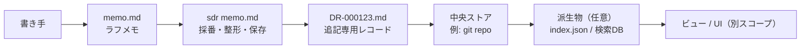
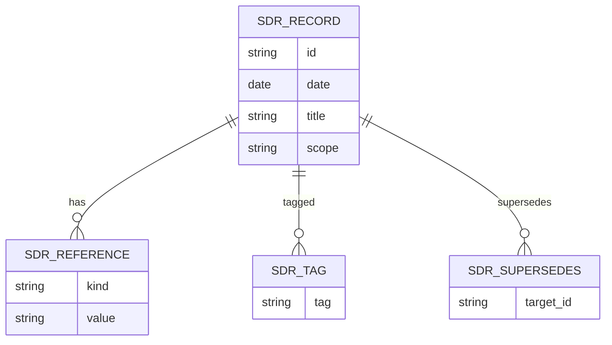
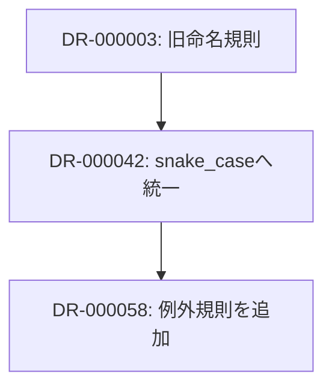
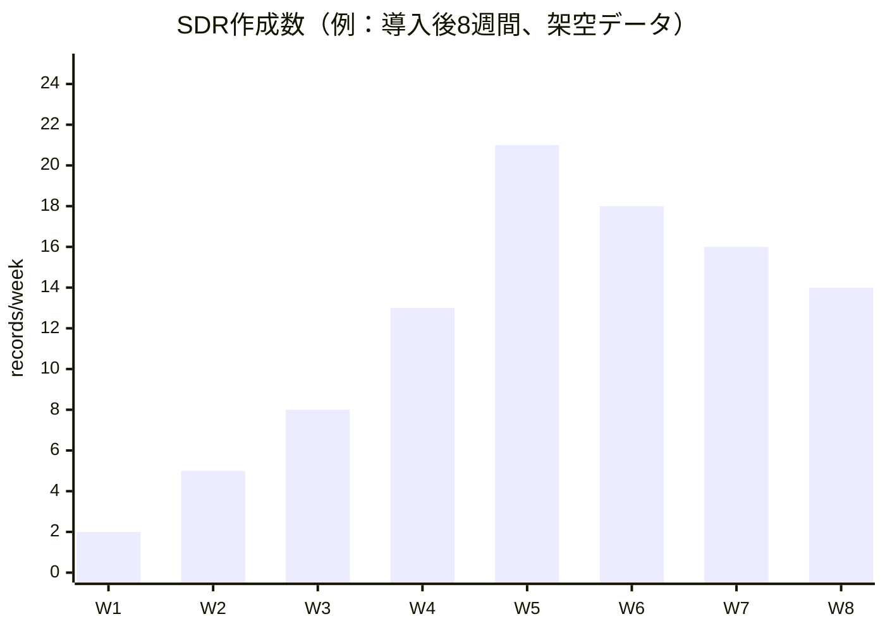

# SDR（Shared Decision Records）に関する調査報告書

## エグゼクティブサマリー

SDR（Shared Decision Records）は、ADR（Architecture Decision Records）を起点にしつつ、対象領域を「アーキテクチャ」に限定せず（カジュアル）、意思決定を一箇所に集約（統一）、追記のみで履歴を積み増し（追記専用・ステータス無し）、最小限のツール（例：`$ sdr memo.md` で自動採番・整形・共有先への保存）で運用する、という構想である（本依頼文の定義に基づく）。この設計意図は、既存の意思決定ドキュメント群（ADR / RFC / PEP / KEP / Decision Log / Design Doc / ODF 等）の「良いところ」を統合し、運用摩擦を最小化しながら、組織学習・説明責任・再現可能性を高める方向にある。

既存概念との近接点としては、(a) ADRの「1件1決定・背景/理由/結果を残す」形式（起点はMichael Nygardの提案）がもっとも近い。一方、SDRの「追記専用・連番・後続文書で更新/置換を表現」は、IETFのRFCシリーズの「逐次番号」「更新/Obsoletes を別文書で表す」モデルに強く似ている。「ツールがなくても成立するが、最小CLIで負担を下げる」は、ADRツーリング（`adr-tools`）や、MADR/log4brains等のdocs-as-code系知識ベースの発想と整合する。

効果面では、ソフトウェア開発では「新規参加者の理解」「監査/説明責任」「設計の意図（why）の保存」が主要ベネフィットであり、学術的にも「意思決定の捕捉は変更コスト低減・再利用性向上・設計劣化（design erosion）低減に寄与しうる」と整理されている。クリエイティブ領域（デザインシステム、制作、企画）でも、Thoughtworksの「Design system decision records」がオンボーディング短縮や合意形成促進に役立ったと述べており、SDRはこの方向（非ソフト領域へ拡張）に適合する。

一方で、SDRは「ステータス無し」を採るため、**"今どれが現行か"** を人手で追うと破綻しやすい。従って、記録自体は追記専用に保ちながらも、「参照関係（supersedes/superseded-by）」「メタデータ」「自動生成インデックス（ビュー側）」で"現行ビュー"を再構成できる前提が重要となる（ビュー/UIは本スコープ外だが、ビューが成立するためのログ設計が不可欠）。この点は、PEPの「メタデータからインデックスを自動生成」や、RFCの「更新/廃止関係をメタデータとして示す」設計が参考になる。

実装は、(1) 中央集約ストア（Git推奨が無難）、(2) 追記専用ファイル群（`DR-000123.md`等）、(3) 最小CLI（採番・整形・保存・コミット/PR作成の補助）、(4) ガバナンス（"何をSDRにするか"と"どう承認するか"）の4点を押さえると、既存ツールを過剰に導入せずとも運用開始できる。GDS（英政府）も「意思決定を可視化するのが目的で、官僚主義を増やすことではない」と述べ、軽量さを重視している。

## SDRの定義と設計原則

SDRを、既存の「意思決定を残す」系アーティファクトの連続体の中で位置づけると、次の"設計選好"が際立つ。

第一に「why（理由）を残す」点ではADR/MADRと同型である。ADRは「重要な意思決定を、その背景や結果とともに短い文書として残す」実践として普及し、Thoughtworksは"進化するアーキテクチャ"ではコードだけでは置換できない決定があるため、文書化を推奨する。MADRの論文も「ADRは設計について"なぜそうしたか"に答え、暗黙知を明示化する」と述べ、決定記録の価値を明確化している。

第二に「追記専用・履歴中心」という点では、RFCシリーズやイベントソーシングに近い。IETFはRFCが逐次番号で編まれ、更新・廃止関係（updates/obsoletes）を含むメタデータで"歴史としての連続性"を保つことを説明している。イベントソーシングは「状態変化をイベント列として追記し、過去状態も再構成できる」考え方であり、「現行状態はログから再構成する」というSDRの"ステータス無し"哲学と比喩的に整合する。

第三に「統一（single place）」は、ADRの典型的な"各リポジトリに決定ログ"とは意図的に異なる。AWSはADRのベストプラクティスとして「中央の場所に保存」し、保存先としてGitリポジトリまたはWikiを挙げる。SDRはこの「中央」を強く志向し、さらに"形式を統一し自動採番で連番ログ化する"ことで、検索・参照・横断利用のベースを作る。

第四に「最小ツール」は、既存のADR CLI（例：`adr-tools`）が示す"軽量な開発者体験"を継承しつつ、SDR固有の要件（追記専用・保存先統一・自動公開）を満たす最小機能に絞る方向である。`adr-tools`はADRをMarkdownファイルとして管理し、`adr`コマンドで初期化・作成を支援する。ただし同ツールは「古いレコードのステータス変更」や「置換時のリンク挿入」など"既存ファイルの更新"を前提としており、SDRの厳密な追記専用とは設計が異なる。

## 類似概念・既存ツールの比較

SDRに近い既存概念は、大きく「ADR系（軽量な決定記録）」「提案/合意プロセス系（RFC/PEP/KEP）」「プロジェクト管理系（Decision Log/Register）」「設計合意・学習系（Design Doc・ODF・デザイン意思決定記録）」「議論構造化・根拠表現（IBIS/Design Rationale）」に分かれる。ADR GitHub組織（adr.github.io）自体も、ADRがAKM（Architectural Knowledge Management）の一部でありつつ、「設計やその他の決定（any decision record）へ拡張可能」と明示しているため、"カジュアル化"の方向性は既に射程に入っている。

### 比較表

| 名称 | スコープ | 追記専用 vs 編集 | 自動採番/自動公開 | 主なツール/媒体 | 典型ユースケース | 長所/短所（要点） | 参考リンク |
|---|---|---|---|---|---|---|---|
| （参考）SDR（提案） | アーキテクチャに限定しない"意思決定全般" | **追記専用**（変更は新DRで参照） | **自動採番＋共有先保存**（ビュー別） | 最小CLI＋共有ストア | 横断的な決定履歴・組織学習 | 長所：運用摩擦を下げつつ履歴を保存／短所：現行判断の抽出はビュー依存 | （本依頼の定義） |
| ADR（Nygard系） | 主にソフトウェアの重要な設計/アーキテクチャ決定 | 多くは編集可＋ステータス管理（運用で差） | 手動～CLIで採番 | Markdown＋VCS（Git等） | "なぜそうしたか"の保存、監査、引継ぎ | 長所：軽量で標準化しやすい／短所：放置されると形骸化、ステータス更新が負担 | |
| Lightweight ADR（Thoughtworks） | ソフトウェアの進化に伴う重要決定 | 基本は編集（Git履歴前提） | 自動は必須でない | ソース管理に保存推奨 | 進化する設計の判断根拠の保存 | 長所：コードと同期しやすい／短所：非エンジニアのアクセス性が課題になり得る | |
| MADR（テンプレ） |（言明上）アーキテクチャに限らず決定一般にも適用 | 編集可（テンプレ） | なし（ツールで補完可） | テンプレ（Front matter等） | ADRの書式統一、ステークホルダー明示 | 長所：メタデータ化しやすい／短所：運用により記載負担が増える | |
| `adr-tools`（CLI） | ADR作成・維持 | **編集を伴う**（既存のstatus変更等） | 採番支援はあり | CLI（bash）＋Markdown | 低摩擦のADR運用開始 | 長所：導入容易／短所："追記専用"とは相性が悪い（更新前提） | |
| Log4brains |（主に）開発/インフラの決定ログ | 編集可（Gitベース） | **自動公開**（静的サイト生成） | docs-as-code知識ベース | ADRをIDE近くで書き、公開する | 長所：公開・閲覧体験が強い／短所：ビュー/サイト生成がスコープに入る | |
| arc42（章「Architecture decisions」） | アーキテクチャ文書テンプレ内の意思決定章 | 多くは編集可 | なし | arc42テンプレ（文書体系） | アーキテクチャ文書に決定履歴を統合 | 長所：体系的文書化と整合／短所：軽量ログとしては重くなりやすい | |
| Google CloudのADRガイダンス | クラウド構築での設計選択と根拠 | 編集可（Markdown＋Git等） | なし | 近接配置（コード近く）推奨 | オプション・要件・決定を記録し参照 | 長所：実務に即した書き方／短所：組織横断の統一ストアは前提でない | |
| Amazon Web Services Prescriptive Guidance（ADR） | プロジェクトの技術意思決定 | 編集可＋履歴/owner重視 | なし | GitまたはWiki推奨 | 技術決定の透明化と推進 | 長所：運用ベストプラクティスが具体的／短所：運用会議が増えうる | |
| Government Digital Service（GDS Way ADR） | 公共部門のアーキテクチャ決定 | 編集可だが、PR状態で暗黙化も提案 | なし | GitHub等VCS | 理由の保存、後任への文脈引継ぎ | 長所：軽量さを重視（官僚主義を増やさない）／短所：superseded明示など運用ルールが必要 | |
| Design system decision records（Thoughtworks） | デザインシステム領域の決定 | 編集可（形式は運用次第） | なし | ADR類似形式 | デザイン変更の根拠・実験・研究の記録 | 長所：オンボーディング短縮・合意形成促進／短所：研究/実験情報の粒度調整が難しい | |
| Open Decision Framework（ODF） | 透明で包括的な意思決定プロセス |（記録というより）プロセス | 自動公開は別 | フレームワーク（ガイド） | 組織横断の合意形成・透明性 | 長所：文化・プロセスの設計指針／短所：小規模では過剰になり得る | |
| Design Doc（Google流の設計合意文書） | ソフトウェア設計の合意形成＋長期ドキュメント | 編集可（ライフサイクルあり） | なし | 文書（テンプレは任意） | トレードオフ・代替案の比較、合意形成 | 長所：合意形成に強い／短所：オーバーヘッド（書く/レビューするコスト） | |
| RFC（例：Rust） | 仕様/機能追加の提案と合意プロセス | 編集可（追補PR） | 番号付与ルールあり（PR番号等） | GitHub PR＋Markdown | 重大変更の設計議論と合意 | 長所：合意形成の制度化／短所：議論コスト・運用疲弊リスク | |
| PEP（Python） | 言語/プロセスの提案文書 | 編集可（VCS履歴） | **公開自動化**（サイト掲載）＋番号は不変 | GitHub repo→自動公開 | 技術仕様＋rationaleの集約 | 長所：長期的な公的記録／短所：編集・レビュー・運営（編集者）が必要 | |
| KEP（Kubernetes） | 大規模OSSの機能拡張提案 | 編集可 | テンプレ/プロセス整備 | GitHub＋VCS永続化 | 影響範囲の大きい変更の整理 | 長所：ロードマップ/マイルストーンを扱える／短所：文書が重くなりがち | |
| Decision Log（プロジェクト管理） | プロジェクト横断の意思決定一覧 | 多くは編集可（表形式） | ツール依存 | Wiki/表/テンプレ | 決定忘れ防止、責任所在、変更管理 | 長所：導入容易・非技術者にも親和／短所：深い技術根拠は別途必要 | |
| Project Decision Register（公的テンプレ例） | 公共プロジェクトの決定記録 | 編集可（表） | 不明 | 公式テンプレ（Excel等） | ガバナンス/監査 | 長所：統制・説明責任に強い／短所：現場の軽量運用とは乖離しうる | |
| Changelog（Keep a Changelog） | 変更点の人間向け記録 | 追記・更新（リリースごと） | なし | `CHANGELOG.md` | 変更履歴の可読化 | 長所：人間向け要約に特化／短所：理由（why）や議論経緯は薄い | |
| IBIS（議論構造化） | 課題→アイデア→長所/短所等で議論を構造化 |（記録というより）構造モデル | なし | 図式/ツールで支援可能 | 合意形成・議論の見える化 | 長所：議論の構造を保存／短所：運用にファシリテーション技能が要る | |

## 有効性と適用可能性の評価

SDRの有効性は、「意思決定の"人間向けログ"を、低摩擦で継続的に積み上げられるか」「後から"現行判断"と"経緯"を取り出せるか」という2点で決まる。既存研究・実務知から、期待効果と失敗モードを分解する。

ソフトウェア開発チームにおける主な便益は、(a) 文脈の保持とオンボーディング、(b) 変更・再設計時の意思決定品質、(c) 監査/説明責任の3つである。GDSは「アジャイルのプロジェクトが長期化し、当時の関係者がいなくなると、意思決定理由の追跡が難しくなる」ため、決定を記録すべきだと述べる。学術的にも、Dan Tofanらは「アーキテクチャは意思決定の結果であり、意思決定の捕捉は変更コスト低減・アーキテクチャ再利用・設計劣化の抑制に実務的便益がある」と整理している。またMADR論文は、意思決定記録が「設計上の"なぜ"に答え、暗黙知を明示化する」と述べる一方、追加ツールによるコンテキストスイッチが生産性を損なう可能性に言及しており、ここはSDRの"最小ツール"思想と一致する。

一方、リスクは「ログが増えるほど探せない」「粒度が揺れて判断根拠が読めない」「運用が形式化して書かれなくなる」ことである。MADR論文の議論では、ADRsを単一フォルダに置く場合のスケール課題（マイクロサービスで粒度/モジュールが異なる）に触れ、解として「カテゴリ付与」または「コード近くに置く」等を挙げている。これはSDRの"統一ストア"と潜在的に緊張するため、SDRでは「統一ストアそのものは1つでも、分類・索引・リンクの設計を強くする」必要がある。PEPが「メタデータからインデックスを自動生成」している点は、SDRが"ビューなしでも成立するログ"を目指しつつ、"ビューが作れるログ設計"を確保する上で重要な参照例になる。

クリエイティブチーム（プロダクトデザイン、制作、編集、ゲーム/映像のプリプロ等）では、意思決定の対象が「技術」より「体験」「スタイル」「コンテンツ方針」「制作ルール」へ広がるため、SDRの"カジュアル"性が活きる。Thoughtworksは「Design system decision records」をADRに倣って採用し、デザインシステムの決定を根拠・リサーチ洞察・実験結果とともに記録することで、オンボーディング短縮、会話の前進、複数ストリームの整合に役立ったと述べる。またDesign Doc実践では、Malte Ublが「設計文書はトレードオフを記述し、代替案を比較し、合意形成と将来の保守者の理解を支える」ことを強調しているが、同時に「書くこと自体がオーバーヘッド」であり、必要性は曖昧性（問題/解の複雑さ）とのトレードオフだとも述べる。クリエイティブ領域は反復が速く曖昧性が高い一方、文書負担も嫌われやすい。よってSDRは、Design Docほど重くせず、Decision Logほど浅くしない"中間の軽量な根拠ログ"として位置づけるのが現実的である。

組織文化・前提条件としては、ODFが示す「透明・包括・顧客中心（customer-centric）」のようなオープン意思決定文化があるほど、SDRの"共有ログ"は機能しやすい。逆に、意思決定が暗黙・属人で、記録が評価されない環境では、ツールを整えても書かれない（もしくは形式だけ残る）。AWSが「各メンバーに作成・オーナーシップを与える」「中央に保存」「定期的な議論/レビューのケイデンス」を推奨している点は、SDR導入でも同様に重要である。

## 実装パターンと最小ツーリング

SDRは「ビュー/UIは別」とされるため、ログ側は"機械で解析しやすく、人間が素で読める"を同時に満たし、後段のビューが"現行状態"を再構成できる最小情報を持つことが要点となる。ここでは、制約未指定（チーム規模・ストレージ・セキュリティ・技術スタック不問）として、実装の選択肢を段階別に示す。

### 基本アーキテクチャ案

保存先は「中央」かつ「履歴・権限・監査」が取りやすいものが良い。実務上の第一候補はGitリポジトリで、Thoughtworksは「ソース管理に置き、コードと同期させる」ことを推奨し、GDSも同様にVCS保存を推奨する。AWSも中央保存先としてGitまたはWikiを挙げるが、SDRの"追記専用＋自動採番"と相性が良いのはGitである。



### 採番方式

SDRの"自動採番"は、RFC/PEPのような連番文化と相性がよい。IETFはRFCが逐次番号でシリーズ化され、更新/廃止の関係もメタデータで管理されることを説明している。PEPも「番号は編集者が割り当て、一度割り当てた番号は変わらない」と明示する。

SDRで使える採番の代表案は次である（選好はチームの運用負担で変わる）。

- 連番固定長（例：`DR-000123`）：差分が読みやすく、ソートが簡単。
- 日付＋連番（例：`DR-2026-04-15-03`）：大量作成で衝突しにくいが、IDが長くなる。
- Gitコミット由来（例：短SHA）：衝突しにくいが、人間が覚えにくい（SDRの目的に反しやすい）。

SDRの「DR-XXをDR-YYで置換」は、参照関係の記述（後述）を必須化すれば、RFCの"updates/obsoletes"と同様の履歴モデルになる。

### 最小メタデータ・スキーマ

PEPはメタデータに基づくインデックス自動生成を行っている。SDRも同様に、ログとしては追記専用で、ビュー側が解析できるメタデータ（最小限）を持つのが望ましい。

提案する最小スキーマ（YAML front matterの例、必須は `id/date/title` 程度）：

- `id`：`DR-000123`
- `date`：作成日（ISO 8601）
- `title`：短い要約
- `scope`：`engineering` / `design` / `biz` / `creative` 等（粗い分類）
- `tags`：検索用タグ
- `deciders`：決定者（役割名でも可）
- `consulted`：相談した相手（任意）
- `references`：チケット、議事録、PR、調査資料、Design Doc等へのリンクID
- `supersedes`：置換対象のDR（任意・複数可）
- `superseded_by`：**書かない**（追記専用で"後から追加"になるため、ビュー側で逆参照生成）



### 最小CLIの具体像

`adr-tools`が「CLIで新規作成・テンプレ適用」を行うように、SDRもCLIで摩擦を下げる。ただし、`adr-tools`はステータス更新等の編集を想定しているため、SDRでは「既存レコードは触らない」を原則にする。

#### 入力（memo.md）の例

```md
# memo.md（ラフ、共有前）

タイトル: 画像アセット命名規則を「snake_case」に統一する
スコープ: creative
タグ: assets, naming, workflow

背景:
- Asana/Slack/フォルダで表記揺れが多く、検索できない
- 外部委託の納品が毎回ブレる

決定:
- 以後、納品・内部制作ともに snake_case を正とする
- 例: hero_banner_v2.png

根拠:
- OS/ツール横断で扱いやすい
- 既存資産の移行コストが比較的小さい

影響:
- 既存ファイルは当面そのまま。新規から適用
- 例外が必要になったら新DRで上書き判断する

参照:
- Miroボード: BOARD-123
- 相談: デザインリード、制作進行
```

#### 実行コマンド例

```bash
$ sdr memo.md
# => DR-000042 を生成し、所定の共有ストアへ保存（例: git repo へ commit / PR 作成）
```

#### 出力（保存されたSDR）の例

```md
---
id: DR-000042
date: 2026-04-15
title: 画像アセット命名規則を snake_case に統一する
scope: creative
tags: [assets, naming, workflow]
deciders: [design-lead, production-manager]
consulted: [engineering-lead]
references:
 - kind: miro
 value: BOARD-123
---

# DR-000042: 画像アセット命名規則を snake_case に統一する

## 背景
Asana/Slack/共有フォルダで命名の表記揺れが頻発し、検索性が低い。外部委託の納品命名も案件ごとに揺れる。

## 決定
以後、納品・内部制作ともに snake_case を正とする。例: `hero_banner_v2.png`

## 根拠
OS/ツール横断で扱いやすく、既存資産の移行コストも比較的小さい。

## 影響
既存ファイルは当面そのまま。新規から適用する。例外が必要になった場合は新DRで判断を上書きする。
```

#### サンプル「レンダリング（擬似プレビュー）」

```text
DR-000042: 画像アセット命名規則を snake_case に統一する
日付: 2026-04-15 / スコープ: creative / タグ: assets, naming, workflow

背景: 表記揺れで検索できない、外部納品がブレる
決定: snake_case を正とする（例: hero_banner_v2.png）
根拠: ツール横断で扱いやすい、移行コストが小さい
影響: 既存は据え置き、新規から適用。例外は新DRで扱う
```

### Gitベース運用と"追記専用"の担保

追記専用を現実に担保するには「運用ルール＋技術的ガード」が必要である。GitHubであれば、保護ブランチにより「レビュー必須」「強制push禁止」などのワークフローを強制できる。またCODEOWNERSで"特定のパス（例：`/sdr/**`）の変更は特定ロールのレビュー必須"を設定できる。これにより、既存SDRの改変が混入しにくくなる。

さらに「既存ファイルを変えずに注釈を付けたい」という要件には `git notes` があり、オブジェクト自体に触れずにノートを付けられる。ただしgit-notesは共有・検索の運用が難しいため、"SDRの主記録"ではなく「SDRとコミットの関連付け」など補助用途が適する。

### 既存ADRからの移行

ADRが既に存在する場合、破壊的移行は避け、次の漸進が現実的である。

- 既存ADRはそのまま保管（アーカイブ）。AWSが「履歴を保存し、旧ADRは決定ログに残す」ことを推奨している点と整合する。
- SDRを開始する最初のDRで「移行宣言」を書く（例：`DR-000001: Decision Records を SDR に統一する`）。
- 重要な既存ADRについては、必要に応じて"要約SDR"を作り、`references` に既存ADRを紐付ける（全文コピーは避け、要点と参照のみ）。
- 以後の更新はSDRのみで行い、GDSが述べるように「実装が進んだ後の変更は新規ADR（=SDR）で説明する」方針に寄せる。

置換関係の表現は、次のような"参照グラフ"でモデル化できる（ビュー側が `supersedes` を辿って"現行"を再構成）。



### 導入後の推移を可視化する例（架空データ）



## ガバナンスとメトリクス

SDRを"カジュアル"に保ちながら価値を出すには、「何を記録するか」「どう合意するか」「どう探せるようにするか」を最小ルールとして定義し、運用を計測する必要がある。

### 推奨ベストプラクティス

意思決定の範囲を「大きな設計」だけに閉じると、クリエイティブや運用/プロセス改善の学習が抜け落ちる。MADRが「アーキテクチャだけでなく、コードや他領域の決定も記録したい」という問題設定を明示している通り、スコープ拡張は合理的である。ただし無制限にするとログがノイズ化するため、次の"記録する基準"を定めるのが現実的である。

- 「後から誰かが同じ論点で迷う可能性がある」
- 「決定がリスク/コスト/外部説明責任を持つ」
- 「複数案の比較（トレードオフ）があった」
- 「チーム間依存（Design system / API / 制作ルール / ガバナンス）」

Design Docが"トレードオフと代替案が重要"と述べる点は、SDRにも適用できる。一方で、Design Docはオーバーヘッドになり得るので、SDRでは「代替案は箇条書きで十分」「詳細は参照に逃がす」という運用がバランスしやすい。

文章の指針としては、Keep a Changelogが「人間のための記録」「リンク可能」「変更タイプを整理」などの原則を掲げる。SDRも"人間の意思決定ログ"である以上、同種の原則（短く、検索しやすく、リンクできる）を採用するのが妥当である。

### ガバナンスルール案

SDRは"ステータス無し"であるため、**承認状態の表現**を別の仕組みで担保する必要がある。GDSは「PRの状態で提案中を表せる」「mainに入ったらacceptedを暗黙化できる」と述べており、これはSDRの"ステータス無し"を正当化する実務案になる。これをSDRに合わせると、次のような規則が作れる。

- 共有ストアの`main`（または保護されたブランチ）に入ったDR = "採用済み"
- 置換は `supersedes` を持つ新DRで行う（旧DRは編集しない）
- レビュー要件は `scope` と `tags` に応じて変える（例：`security` タグは必ずセキュリティ担当レビュー）
- "議論の場"は参照に記録する（Issue/PR/議事録/Design Doc）。Kubernetes KEPが「単一Issue/PRを超える抽象」が必要だと述べるように、大きい決定は関連痕跡が散らばるため、参照の束ねが重要になる。

会議体については、AWSが「導入初期はADR議論が激しくなるが、2〜3スプリントで安定し得るので、定期レビューのケイデンスを作る」ことを推奨している。SDRでも、初期は"書き方"や"記録対象"の合意形成が必要なので、短い定例（例：週1の15分）を置くのが実務的である。

### メトリクス設計

SDRの価値は「書いた量」ではなく「参照され、判断が速く/良くなる」ことである。メトリクスは、(a)採用度、(b)運用品質、(c)成果への接続 の3層で設計すると解釈しやすい。

- 採用度（Adoption）
 - 週/月あたりの新規DR数（過剰に増えすぎるとノイズ化の兆候）
 - 作成者の分布（特定個人に偏ると属人化）。AWSは"各メンバーが作成・所有できる"ことを推奨しているため、偏りは重要信号になる。
 - 作成までのリードタイム（決定→記録）。Decision Logが「いつ・誰が・なぜ」を残すことを強調する通り、遅延は"忘却"を招く。

- 運用品質（Quality）
 - `references` の充足率（証跡がないDRは再利用性が低い）
 - `supersedes` を伴うDRの比率（変更を"新DRで扱う"文化が育っているか）
 - 検索成功率（"探せた/探せない"を定例で自己申告でも良い）

- 成果（Outcome）
 - オンボーディング時間の短縮（Thoughtworksはデザイン領域で短縮効果を示唆）。
 - 重複議論の減少（同じ論点の会議回数が減る、Decision Logが狙う"decision amnesia"抑制の方向）。
 - 重大な設計変更の回避/早期是正（定性的でも良い）

メトリクスを"監視"に使うと逆効果になりやすい（書くこと自体が負担なので、評価に紐づけると形骸化する）。GDSが「目的は可視化であって官僚主義を増やすことではない」と述べる点を、計測設計にも適用すべきである。

## 重要参考文献

本調査で特にSDR設計の"芯"に効く一次・公式・学術ソースを優先度順に整理する。

一次・公式ソースとして、ADRの起点はMichael Nygardの提案（Cognitectブログ）であり、ADRが「重要決定を1件1文書で残し、後続決定の文脈にもなる」ことを明示している。ADRの普及・実務推奨としてはThoughtworksのTechnology Radarが「進化するアーキテクチャでは決定の記録が必要で、ソース管理に保存するとコードと同期できる」と述べる。実装・運用規範の具体例として、AWS Prescriptive Guidanceは「中央保存」「各メンバーのオーナーシップ」「旧ADRをSupersededにして履歴保存」「定期レビューのケイデンス」を提示している。公的組織での軽量実装としてはGDS Wayが「理由の保存」「VCS保存」「main投入でacceptedを暗黙化」「superseded表示の必要性」を述べる。

SDRの"追記専用・連番・置換を新文書で表現"の参照モデルとしては、IETFのRFC説明が「逐次番号」「updates/obsoletes」「権威サイト」「プロセス透明性」等をまとめている。同様に、PEPは「番号は不変」「VCS履歴が歴史記録」「GitHub→Web自動公開」「メタデータに基づくインデックス自動生成」を提供しており、SDRの"ログ設計"に直結する。

学術的裏付けとしては、Dan Tofanらのシステマティック・マッピング研究が、意思決定研究の潮流と「捕捉の便益（変更コスト低減・再利用・設計劣化抑制）」を整理している。MADRに関しては、Olivier Koppらの論文が「whyに答える」「ツール追加によるコンテキストスイッチの害」「スケール課題（単一フォルダ vs マイクロサービス）」など、SDRの設計判断に直結する論点を提供する。

日本語ソースとしては、Google CloudのADR概要が「主要オプション・要件・決定を記録し、コード近くのMarkdownに保存する」実務像を明示している。ADR運用の日本語事例としては、サーバーワークスの運用記事やZennでの導入・ルール例が、導入プロセス・ルール設計・Design Docsとの差分などを示している。クリエイティブ寄りの拡張はThoughtworksのDesign system decision recordsが一次的な実務根拠となる。さらに、議論構造化（IBIS）についてはJapan Science and Technology Agency系の公開資料が、Issue/Idea/長所短所の構造を日本語で整理しており、SDRの"議論→決定→根拠"を扱う際の補助理論になる。
